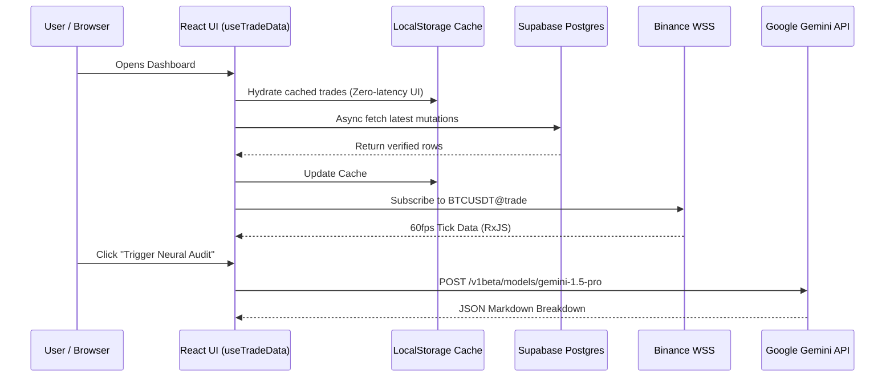

# System Design & Architecture

## 1. Architectural Paradigm

The Trader Dashboard is built on a **Thick Client Serverless Architecture**. 
Unlike traditional Model-View-Controller (MVC) server-rendered applications, this system completely decouples the user interface from the backend infrastructure. 

1. **Thick Client**: The React 19 frontend is responsible for heavy computational logic. Expectancy calculations, CSV parsing, data aggregation, and charting are all processed locally in the user's browser.
2. **Serverless Backend**: Supabase (PostgreSQL) acts as a high-availability, serverless persistence layer. It handles state synchronization, identity management, and edge computing without the need to maintain dedicated Node.js/Python server instances.

---

## 2. Layered Architecture Breakdown

### 2.1 The Presentation Layer (React + Vite)
The presentation layer is built for absolute maximum performance and density, avoiding deep routing trees in favor of a "terminal" style single-page view.

* **Component Orchestration**: `App.jsx` acts as the root orchestrator, heavily utilizing local state (`useState`) and deeply memoized mathematical derivations (`useMemo`) to prevent unnecessary re-renders when parsing hundreds of trades.
* **Component Decoupling**: Core visual elements are strictly decoupled:
  * `MetricCard.jsx` & `ScoreBar.jsx` for isolated metric rendering.
  * `Chart.jsx` (Recharts) & `AlertsView.jsx` (Lightweight Charts) for canvas-based GPU rendering.
  * `DailyBriefingPopup.jsx` for modal-based AI interaction.
* **State Management**: The application bypasses Redux/Zustand in favor of a powerful custom hook: `useTradeData.js`. This hook consumes raw Supabase arrays and outputs derived metrics (Win Rate, Profit Factor, Expectancy).

### 2.2 The Service Layer (Frontend Integrations)
All external communications from the React app are abstracted into dedicated singleton service classes (`src/services/`):

* **`supabaseService.js`**: Wraps the `@supabase/supabase-js` client. Implements a `normalizeRow` adapter pattern to transform strictly-typed SQL rows into flexible JavaScript objects expected by the UI.
* **`geminiService.js`**: Manages the API key lifecycle (stored locally or pulled from env), constructs multi-shot prompts, and handles the streaming or blocking execution of the AI Neural Engine.
* **`binance.js`**: Connects via native `WebSocket` to `wss://stream.binance.com:9443/ws`. It utilizes `rxjs` (`Subject`) to broadcast tick-level price updates directly to the `AlertsView.jsx` canvas, bypassing React state to avoid 60fps render thrashing.

### 2.3 The Infrastructure Layer (Supabase)
The backbone of the application running on AWS via Supabase:

* **PostgreSQL Database**: Relational data store enforcing data integrity.
* **Supabase Auth**: JWT-based identity management.
* **Row Level Security (RLS)**: Enforces tenant isolation. Every query automatically appends `where user_id = auth.uid()` natively at the database level.
* **Supabase Storage**: S3-compatible buckets for `avatars`, `chart-screenshots`, and `snapshots`.

### 2.4 The Edge Compute Layer (Deno Edge Functions)
To prevent the frontend from executing long-running or secret-dependent tasks, the architecture leverages Supabase Edge Functions:

* **`check-alerts`**: A server-side daemon triggered by `pg_cron` that checks live market prices against user `alerts` tables and dispatches Telegram webhooks.
* **`fetch-market-events`**: Pulls high-impact macro data from Investing.com, avoiding CORS issues, and parses it into the `economic_events` table.
* **`sync-[broker]-trades`**: Encrypts broker API keys and securely polls Dhan/Delta exchanges for raw execution logs.

---

## 3. Data Flow Diagram

The following Mermaid diagram maps out the data synchronization lifecycle across the application:

---

## 4. Integration Maps

### 4.1 Internal API Boundaries
1. **Frontend to Database**: Direct POST/GET using `supabase-js`. Secured by RLS. No intermediate backend server is used.
2. **Frontend to External APIs**: Direct fetch calls to `https://api.exchangerate-api.com` (for INR/USD conversion) and `generativelanguage.googleapis.com` (for Gemini).

### 4.2 Broker Sync Architecture
1. The user inputs their API Key/Secret in `BrokerSyncCenter.jsx`.
2. Supabase stores this credentials map in a secure `brokers` table.
3. The user triggers a sync. Supabase Edge Function `sync-dhan-trades` is invoked.
4. The Edge Function pulls raw fills from the broker and inserts them into `raw_broker_fills`.
5. A secondary Edge Function `reconstruct-dhan-trades` runs over the raw fills, stitches entry and exit legs, calculates net P&L, and upserts the result into the primary `trades` table.
6. Supabase Realtime pushes the new trades to the React UI.
