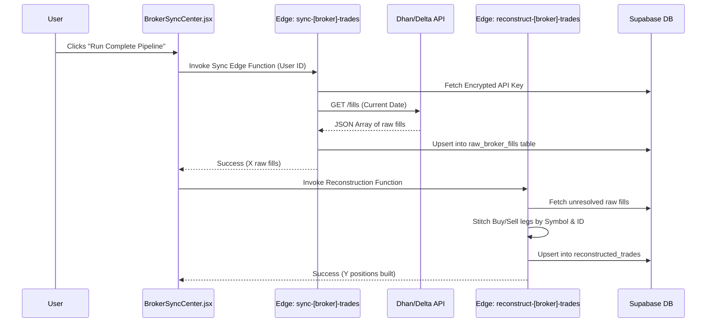

# Broker Sync & Data Ingestion

## 1. Overview
The **Broker Sync Center** is a critical infrastructural module designed to automate the painful process of manual trade entry. It securely integrates with specific broker APIs, pulls raw execution fills, reconstructs them into logical trade loops, and allows the trader to enrich the automated data with manual behavioral metrics.

## 2. Supported Broker Integrations
* **Dhan Broker** (Indian Equities, F&O)
* **Delta Exchange India** (Crypto Derivatives)

---

## 3. End-to-End Ingestion Pipeline

The pipeline is split into a **Frontend UI Layer** and a **Serverless Compute Layer (Deno Edge Functions)** to ensure absolute security for API keys.

### 3.1 Security & Credential Storage
1. The user inputs their API Key, Secret, and Client ID in `BrokerSyncCenter.jsx`.
2. The React app sends these via a secure Supabase RPC/REST call to the `brokers` table.
3. **Database Security**: Keys are stored encrypted using pgcrypto or secure RLS boundaries. The frontend *cannot* retrieve decrypted API secrets after they are saved.

### 3.2 The Sync Flow

---

## 4. The Reconstruction Algorithm

Raw exchange fills do not represent "Trades" in a journaling sense. A single limit order may execute across 5 different fills. The `reconstruct-trades` Edge Functions are designed to group these mathematically.

### 4.1 Grouping Logic
1. Sort raw fills chronologically.
2. Group by `symbol` and `order_id` / `correlation_id`.
3. Track running position sizes.
4. When a position size crosses `0` (e.g., Long 50, Sell 50), the "loop" is closed.

### 4.2 Deduplication Strategy
* To prevent duplicate trades from appearing if the user hits "Sync" twice, reconstructed trades are assigned a deterministic hash/UUID based on `entry_time + symbol + user_id`. 
* Supabase uses an `UPSERT` conflict policy on this deterministic ID.

---

## 5. UI Integration & Manual Enrichment
Once trades are reconstructed in the backend, they are pulled into `BrokerSyncCenter.jsx` as "Pending Trades".

### 5.1 The Review Queue
* The user views an inbox of newly synced trades.
* They click "Edit & Add" to open the standard `AddTradeModal.jsx`.
* The modal is **pre-filled** with the exact Entry Price, Exit Price, Asset, Size, and P&L calculated by the Edge Function.
* **Enrichment**: The user is then forced to manually append the missing qualitative data (Strategy, Emotion, Mistakes) before it is finally moved into the master `trades` table.

This hybrid approach ensures mathematically perfect P&L recording while still requiring the trader to engage in the psychological journaling process.
