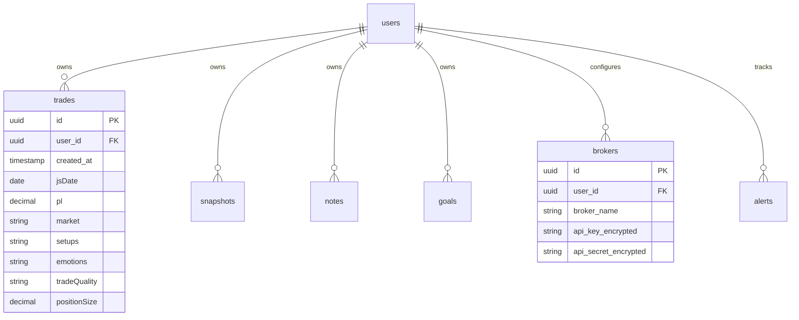

# Database Schema & Data Logic

## 1. Relational Overview
The Trader Dashboard relies on a highly normalized **PostgreSQL** database hosted on Supabase. Security and tenant-isolation are strictly enforced at the database level using **Row Level Security (RLS)**.



---

## 2. Table Definitions

### 2.1 `trades` (Primary Ledger)
This table acts as the master immutable ledger for all executions. 
* **`pl` (Decimal)**: Core metric used across the app to determine if a trade is a Win or Loss.
* **`setups`, `emotions`, `tradeQuality` (Varchar/Text)**: String tags used heavily by the `useTradeData.js` hook to build `setupAnalysisMap` and `emotionalPnlMap`.
* **Broker Injection**: Trades injected automatically by `reconstruct-[broker]-trades` Edge Functions are flagged with `entry_time` and `exit_time` fields to prevent overlaps.

### 2.2 `snapshots` (Media Vault)
* Stores references to images hosted in **Supabase Storage**.
* **Columns**: `image_url` (public or signed URL), `caption`, `user_id`.

### 2.3 `notes` (Journaling)
* Tracks daily market reviews, priority checklists, and trader psychology.
* **Columns**: `content` (Markdown supported), `category` (Learning vs. Mistake), `votes` (determines Priority ranking in the AI briefing).

### 2.4 `economic_events` (Macro Intelligence)
* A globally shared table (Not isolated by RLS `user_id`!).
* **Population**: Deno Edge Function runs every 3 hours pulling from external APIs.
* **Columns**: `date_time`, `currency`, `event_name`, `importance`, `actual`, `forecast`.

### 2.5 `alerts` (Automated Webhooks)
* **Columns**: `symbol`, `price_level`, `condition` (`GREATER_THAN`, `LESS_THAN`), `status` (`ACTIVE`, `TRIGGERED`).
* Used by the `check-alerts` background cron job to send Telegram webhooks.

---

## 3. Data Integrity & Security

### 3.1 Row Level Security (RLS)
The absolute core of the application's security model. The frontend **never** passes a `user_id` in its API requests. Instead, the Supabase PostgreSQL instance extracts the `uid` directly from the signed JWT token.

```sql
-- Example Policy
CREATE POLICY "Users can only view their own trades"
ON trades FOR SELECT
USING ( auth.uid() = user_id );
```

### 3.2 Offline First / Local Cache 
To achieve "Instant Load" performance, the `App.jsx` entry point initially ignores the database and hydrates the UI synchronously from `localStorage`.
1. App reads `tr_trades_v7` from browser cache $\rightarrow$ Renders UI instantly.
2. App fires async `supabaseService.fetchTrades()` in the background.
3. Once the database responds, React compares lengths and updates state if a delta exists.

### 3.3 Concurrency & Edge Deduplication
For background tasks like the Cron-triggered `check-alerts`, optimistic concurrency control is used:
* The Edge function attempts an `UPDATE alerts SET status = 'TRIGGERED' WHERE status = 'ACTIVE' AND id = X`.
* It relies on Postgres atomic updates. If two edge nodes run simultaneously, only one will successfully mutate the row and trigger the Telegram webhook, preventing duplicate spam.
