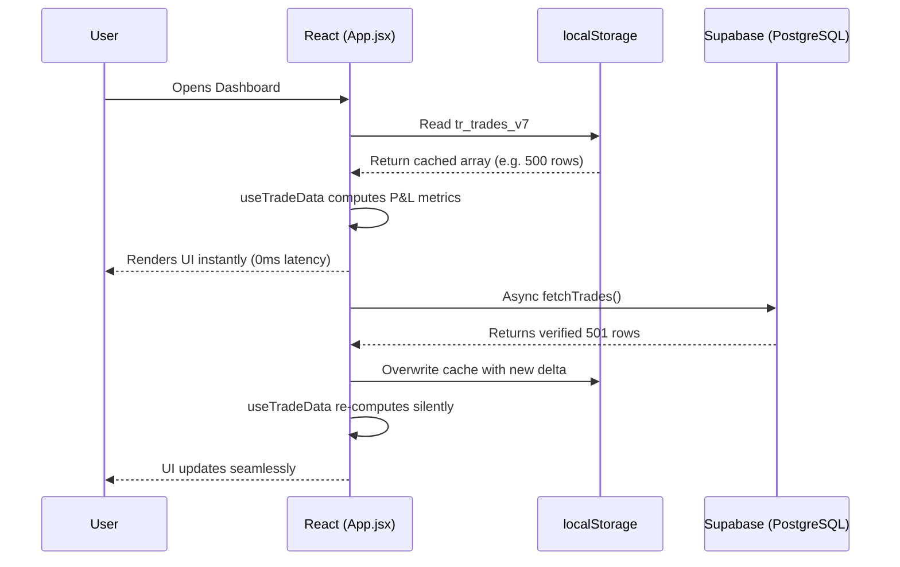

# User Journeys & State Flows

## 1. Overview
This document maps out the specific paths a user takes through the system, visualizing how the UI state, local cache, and backend database interact across lifecycles.

---

## 2. Boot & Hydration Journey

The most critical path in the system is the "Instant Boot" sequence, ensuring traders aren't waiting on spinners.

---

## 3. Daily Routine & AI Briefing Flow

To ensure psychological adherence, the dashboard forces a pre-market routine.

1. **Morning Checklist Modal**:
   * **Trigger**: User opens the app for the first time that day.
   * **Flow**: A hard-blocking modal (`MorningChecklist.jsx`) appears. The user must physically check boxes confirming they are emotionally stable, have reviewed the calendar, and understand their risk limit.
2. **AI Pre-Warming**:
   * While the user is clicking through the checklist, the `DailyBriefingPopup.jsx` fires a background request to the Gemini API (`geminiService.js`).
3. **The Handoff**:
   * User clicks "Ready to Trade".
   * The checklist dismisses, and the `DailyBriefingPopup` appears instantly. Because of the pre-warming, the Neural Analysis is already loaded, providing the user with "The 3 Priority Steps" for the day.

---

## 4. Manual Trade Entry & Sync Flow

1. **Entry**: User clicks "+" in the Master Table.
2. **Modal**: The `AddTradeModal.jsx` opens.
3. **Input Validation**: App verifies that `Date`, `Asset`, `Direction`, and `Lot Size` are present.
4. **Optimistic Update**: 
   * The React app creates a temporary ID, pushes the trade into the local state array, and immediately re-renders the charts and P&L metrics.
5. **Background Sync**: 
   * The app fires `supabase.from('trades').insert()`.
   * If the Supabase call fails, a toast notification alerts the user, and the temporary trade is rolled back out of the state array.

---

## 5. Live Chart Alert Trigger Flow

1. **Creation**: User clicks a price level on the `Lightweight Chart` in `AlertsView.jsx`.
2. **State Storage**: The alert is saved to the `alerts` table via Supabase with `status = 'ACTIVE'`.
3. **Real-time Engine**: 
   * The `AlertsView` component sets up a `supabase.channel('alerts').on('postgres_changes')` listener.
4. **Backend Trigger**: 
   * `check-alerts` Edge Function detects a price breach and sets `status = 'TRIGGERED'`.
5. **UI Reaction**: 
   * The Supabase websocket pushes the mutation to the React frontend. The horizontal price line automatically turns Red and vanishes from the chart without requiring a page refresh.
