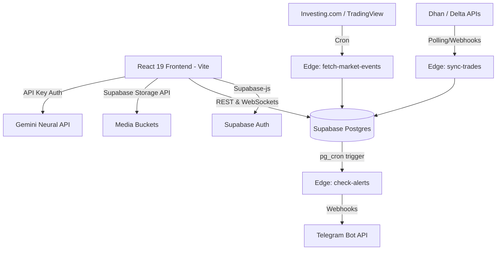

# Trader Dashboard - Master Blueprint

## 1. Executive Overview

### Purpose
The Trader Dashboard is a sophisticated, institutional-grade web application designed for professional and proprietary traders. Its primary goal is to serve as a comprehensive performance auditing and journaling system that provides deep mathematical, behavioral, and macroeconomic insights into a trader's execution patterns.

### Business Goals
* **Performance Analytics**: Translate raw trade execution data into high-level expectancy, profit factor, and behavioral leak metrics.
* **Psychological Auditing**: Correlate emotional states and pre-market discipline (routines) with statistical outcomes.
* **Macro Integration**: Merge real-time geopolitical and macroeconomic event tracking with personal trading sessions.
* **Broker Synchronization**: Automate the ingestion of raw exchange fills to eliminate manual entry friction while supporting manual override capabilities.

### Target Audience
* Institutional quantitative traders.
* Proprietary (prop) firm traders managing funded accounts.
* Advanced retail traders requiring sophisticated performance attribution.

### Core Features
* **AI Neural Engine**: Integrates Gemini API for deep-dive statistical analysis, daily market briefings, and pattern anomaly detection.
* **Broker Sync Center**: Secure, automated trade ingestion for Dhan (Indian F&O) and Delta Exchange (Crypto) via dedicated Deno Edge Functions.
* **Automated Telegram Alerts**: 24/7 backend price monitoring via `pg_cron` delivering formatted execution alerts.
* **Interactive Heatmaps & Calendars**: GitHub-style activity matrices and visual monthly P&L calendars.
* **Utility Data Hub**: Secure CSV import parsing, local cache resets, and SQL snapshot generation.

---

## 2. Complete Architecture Overview

The system is designed with a deeply modular, high-density Single Page Application (SPA) frontend, backed by a highly secure, serverless database and edge compute architecture.

### High-Level System Architecture

### 2.1 Frontend Architecture
* **Core Framework**: React 19 bootstrapped with Vite for instant Hot Module Replacement (HMR).
* **State Management**: Highly localized custom hooks (e.g., `useTradeData.js`) manage heavy computational state (expectancy calculations), completely decoupled from UI rendering cycles. `localStorage` is used alongside React Context for immediate, offline-first data hydration (`tr_trades_v7`, `tr_snapshots_v7`).
* **Design System**: Built on Tailwind CSS heavily utilizing deep dark palettes (`Slate 950`), custom CSS glassmorphism classes (`modern-glass`), absolute positioned light rays, and interactive framer-motion micro-animations.
* **Routing**: Single Page "Non-Scroll" Tab architecture mimicking terminal interfaces (Bloomberg Terminal, MetaTrader).

### 2.2 Backend & Infrastructure Architecture (Supabase Ecosystem)
* **Database Layer (PostgreSQL)**: Master source of truth. Contains strongly typed tables for `trades`, `snapshots`, `notes`, `goals`, `economic_events`, and `brokers`.
* **Row Level Security (RLS)**: Enforced at the Postgres level. Every table requires `user_id` validation via Supabase Auth JWTs.
* **Compute Layer (Deno Edge Functions)**:
  * **Ingestion Pipelines**: `sync-dhan-trades`, `reconstruct-dhan-trades`.
  * **Intelligence Pipelines**: `fetch-market-events` (populating macroeconomic data).
  * **Alerting Pipelines**: `check-alerts` running via `pg_cron` to monitor live price thresholds against user-defined setups.
* **Real-time Layer**: Supabase Channels push instant database mutations back to the React UI (e.g., clearing triggered alerts instantly on the chart overlay).

### 2.3 Monolithic Frontend / Serverless Backend Strategy
The application operates as a "Thick Client" Monolith. The React frontend handles almost all business logic mapping, UI aggregation, and CSV parsing locally in the browser to ensure instantaneous feedback. The backend (Supabase) acts purely as a secure data persistence layer, identity provider, and isolated worker environment for tasks that must run 24/7 (Broker Sync, Telegram Alerts, Macro Event fetching).

---

## 3. Technology Stack Definitions

| Layer | Technology | Purpose |
| :--- | :--- | :--- |
| **Frontend Framework** | React 19 (Vite) | UI Component rendering, HMR, modular SPA architecture. |
| **Styling** | Tailwind CSS | Rapid UI development, custom utility classes, dark-mode themes. |
| **Animation** | Framer Motion | Fluid mount/unmount transitions, layout animations. |
| **Data Visualization**| Recharts & Lightweight Charts | Financial time-series plotting, interactive pie/bar charts. |
| **Backend / DB** | Supabase (PostgreSQL) | Master database, realtime subscriptions, JWT authentication. |
| **Serverless Compute** | Deno (Supabase Edge) | Off-main-thread processing (Broker Sync, Telegram Alerts). |
| **AI Integration** | Google Gemini API | Natural language processing for daily briefings and trade audits. |
| **Live Price Feeds** | Binance WebSockets | RxJS-powered live charting and active alert threshold lines. |

## 4. Documentation Ecosystem Index

Welcome to the Master Documentation Ecosystem. Navigate through the detailed sections below to explore every layer of the Trader Dashboard.

### 🏗️ Architecture & Design
* [System Design & Architecture](./architecture/system-design.md) - Deep dive into monolithic vs modular structure, diagrams, and integration maps.

### 🧠 Business Logic
* [Trading Rules & Metrics](./business-logic/trading-rules.md) - Mathematical breakdowns of expectancies, risk management, and setup tracking.
* [AI Neural Engine](./business-logic/ai-engine.md) - Gemini API integration, anomaly detection algorithms, and prompt structures.
* [Broker Sync & Ingestion](./business-logic/broker-sync.md) - Pipeline architecture for Dhan/Delta parsing, deduping, and reconstruction.

### 🌐 API & Integrations
* [API Catalog](./api/api-catalog.md) - Complete endpoints, payloads, rate limits, and third-party interactions (Telegram, Binance, Investing.com).

### 🗄️ Database & Security
* [Database Schema](./database/schema.md) - Supabase Postgres table definitions, RLS policies, relationships, and ER diagrams.
* [Security Architecture](./security/architecture.md) - Authentication flows, token handling, secrets management, and data isolation.

### 🖥️ Frontend Architecture
* [Frontend Components](./frontend/components.md) - React tree structure, core UI logic, state management (`useTradeData`), and decoupling strategies.
* [Design System](./frontend/design-system.md) - Tailwind tokens, glassmorphism, typography, and animation standards.

### ⚙️ Backend & Edge Compute
* [Edge Functions & Services](./backend/edge-functions.md) - Deno functions (`check-alerts`, `sync-trades`), pg_cron scheduling, and Webhook integrations.

### 🔄 Flows & Operations
* [User Journeys & Flows](./flows/user-journeys.md) - Visualized step-by-step lifecycles for logins, alerts, and trade execution.
* [Deployment & DevOps](./deployment/infrastructure.md) - Build process, CI/CD, Vite optimization, and environment configurations.

---

*This document serves as the top-level architectural blueprint. Click any of the links above to navigate the detailed modules.*
